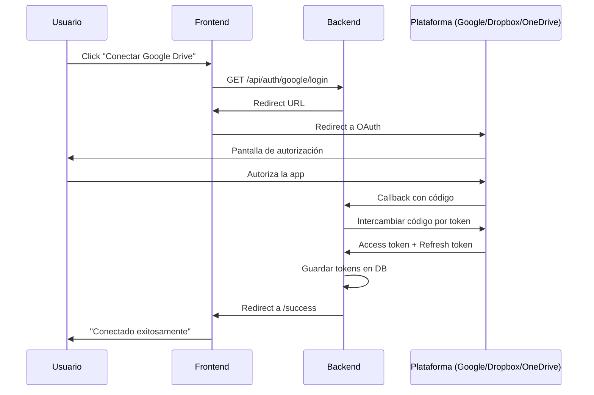

# 🔗 Guía de Integración con Plataformas Cloud

Esta guía te ayudará a configurar las integraciones con **Google Drive**, **Dropbox** y **OneDrive** para tu aplicación empresarial.

---

## 📊 Comparativa Rápida

| Plataforma | Dificultad | Tiempo Setup | OAuth2 | Límites API | Mejor para |
|------------|-----------|--------------|---------|-------------|------------|
| **Google Drive** | Media | 15-20 min | ✅ Sí | 100-1000 req/100s/user* | Empresas Google Workspace |
| **Dropbox** | Fácil | 10-15 min | ✅ Sí | 500 req/min | Colaboración simple |
| **OneDrive** | Media-Alta | 20-30 min | ✅ Sí | Variable | Empresas Microsoft 365 |

*Google Drive: Por defecto 100 req/100s por usuario, configurable hasta 1000. Límite proyecto: 12,000 req/min

---

## 1️⃣ Google Drive - Mejorar Integración Actual

### ✅ Estado Actual
Ya tienes una integración funcional, pero necesita mejoras para uso empresarial.

### 🔧 Problemas a Resolver

#### Problema 1: Requiere usuario autorizado manualmente
**Solución**: Implementar OAuth2 con flujo web para que cada usuario autorice su propia cuenta.

#### Problema 2: Token expira y requiere reautenticación manual
**Solución**: Implementar refresh token automático y almacenamiento por usuario.

### 📋 Pasos para Mejorar

#### **Paso 1: Configurar Google Cloud Console**

1. Ve a [Google Cloud Console](https://console.cloud.google.com/)
2. Selecciona tu proyecto o crea uno nuevo
3. Ve a **APIs & Services** → **Credentials**
4. Configura la **OAuth consent screen**:
   - **User Type**: Selecciona "External" (para cualquier usuario) o "Internal" (solo tu organización)
   - **App name**: "Photo Upload Manager" (o el nombre de tu app)
   - **User support email**: Tu email
   - **Developer contact**: Tu email
   - **Scopes**: Añade `https://www.googleapis.com/auth/drive.file` (acceso solo a archivos creados por la app)
   - **Test users**: Añade emails de usuarios de prueba (solo si está en modo Testing)

5. Crea **OAuth 2.0 Client ID**:
   - **Application type**: "Web application"
   - **Name**: "Photo Upload Web Client"
   - **Authorized JavaScript origins**: 
     - `http://localhost:5173` (desarrollo)
     - `https://tudominio.com` (producción)
   - **Authorized redirect URIs**:
     - `http://localhost:8000/api/auth/google/callback` (desarrollo)
     - `https://api.tudominio.com/api/auth/google/callback` (producción)

6. Descarga el archivo `credentials.json` y colócalo en `/backend/`

#### **Paso 2: Publicar la App (Opcional pero Recomendado)**

Si quieres que cualquier usuario pueda usar la app sin estar en la lista de "Test users":

1. En **OAuth consent screen**, haz clic en **"PUBLISH APP"**
2. Google puede requerir verificación si solicitas scopes sensibles
3. Para scopes básicos como `drive.file`, la verificación es rápida

#### **Paso 3: Modificar el Backend**

Necesitas cambiar de autenticación local a OAuth2 web flow:

```python
# Cambios necesarios en backend/services/google_drive.py
# - Eliminar run_local_server()
# - Implementar OAuth2 callback endpoint
# - Almacenar tokens por usuario en base de datos
```

#### **Paso 4: Implementar Base de Datos para Tokens**

Necesitarás almacenar tokens por usuario. Opciones:
- **SQLite** (simple, para empezar)
- **PostgreSQL** (producción)
- **MongoDB** (NoSQL)

---

## 2️⃣ Dropbox - Nueva Integración

### 📋 Pasos Completos

#### **Paso 1: Crear App en Dropbox**

1. Ve a [Dropbox App Console](https://www.dropbox.com/developers/apps)
2. Haz clic en **"Create app"**
3. Configuración:
   - **Choose an API**: Dropbox API
   - **Choose the type of access**: Full Dropbox (o App folder si prefieres limitado)
   - **Name your app**: "PhotoUploadManager" (debe ser único)
4. Haz clic en **"Create app"**

#### **Paso 2: Configurar OAuth2**

En la página de configuración de tu app:

1. **OAuth 2**:
   - **Redirect URIs**: Añade:
     - `http://localhost:8000/api/auth/dropbox/callback`
     - `https://api.tudominio.com/api/auth/dropbox/callback` (producción)

2. **Permissions** (Scopes necesarios):
   - ✅ `files.content.write` - Subir archivos
   - ✅ `files.content.read` - Leer archivos
   - ✅ `files.metadata.write` - Crear carpetas
   - ✅ `files.metadata.read` - Listar carpetas

3. Copia:
   - **App key** (Client ID)
   - **App secret** (Client Secret)

#### **Paso 3: Instalar SDK de Dropbox**

```bash
cd backend
./venv/bin/pip install dropbox
```

#### **Paso 4: Variables de Entorno**

Crea/edita `backend/.env`:

```env
# Dropbox
DROPBOX_APP_KEY=tu_app_key_aqui
DROPBOX_APP_SECRET=tu_app_secret_aqui
DROPBOX_REDIRECT_URI=http://localhost:8000/api/auth/dropbox/callback
```

#### **Paso 5: Código Base**

```python
# backend/services/dropbox_service.py
import dropbox
from dropbox.oauth import DropboxOAuth2Flow

class DropboxService:
    def __init__(self, access_token=None):
        self.dbx = dropbox.Dropbox(access_token) if access_token else None
    
    def create_folder(self, path):
        """Crear carpeta en Dropbox"""
        try:
            self.dbx.files_create_folder_v2(path)
            return True
        except dropbox.exceptions.ApiError as e:
            if e.error.is_path() and e.error.get_path().is_conflict():
                return True  # Carpeta ya existe
            return False
    
    def upload_file(self, file_path, dropbox_path):
        """Subir archivo a Dropbox"""
        with open(file_path, 'rb') as f:
            self.dbx.files_upload(f.read(), dropbox_path, mode=dropbox.files.WriteMode.overwrite)
```

---

## 3️⃣ OneDrive / SharePoint - Nueva Integración

### 📋 Pasos Completos

#### **Paso 1: Registrar App en Azure**

1. Ve a [Azure Portal](https://portal.azure.com/)
2. Busca **"Azure Active Directory"** o **"Microsoft Entra ID"**
3. Ve a **App registrations** → **New registration**
4. Configuración:
   - **Name**: "PhotoUploadManager"
   - **Supported account types**: 
     - "Accounts in any organizational directory and personal Microsoft accounts" (multi-tenant)
   - **Redirect URI**: 
     - Platform: **Web**
     - URI: `http://localhost:8000/api/auth/microsoft/callback`
5. Haz clic en **"Register"**

#### **Paso 2: Configurar Permisos (API Permissions)**

1. En tu app, ve a **API permissions**
2. Haz clic en **"Add a permission"**
3. Selecciona **"Microsoft Graph"**
4. Selecciona **"Delegated permissions"**
5. Añade estos permisos:
   - ✅ `Files.ReadWrite` - Leer/escribir archivos del usuario
   - ✅ `Files.ReadWrite.All` - Leer/escribir todos los archivos (si necesitas acceso completo)
   - ✅ `offline_access` - Refresh token
   - ✅ `User.Read` - Información básica del usuario
6. Haz clic en **"Grant admin consent"** (si eres admin)

#### **Paso 3: Crear Client Secret**

1. Ve a **Certificates & secrets**
2. Haz clic en **"New client secret"**
3. **Description**: "Production secret"
4. **Expires**: 24 months (o el que prefieras)
5. Haz clic en **"Add"**
6. **⚠️ IMPORTANTE**: Copia el **Value** inmediatamente (solo se muestra una vez)

#### **Paso 4: Copiar IDs**

En la página **Overview** de tu app, copia:
- **Application (client) ID**
- **Directory (tenant) ID**

#### **Paso 5: Instalar SDK de Microsoft**

```bash
cd backend
./venv/bin/pip install msal requests
```

#### **Paso 6: Variables de Entorno**

Añade a `backend/.env`:

```env
# Microsoft OneDrive
MICROSOFT_CLIENT_ID=tu_client_id_aqui
MICROSOFT_CLIENT_SECRET=tu_client_secret_aqui
MICROSOFT_TENANT_ID=tu_tenant_id_aqui
MICROSOFT_REDIRECT_URI=http://localhost:8000/api/auth/microsoft/callback
```

#### **Paso 7: Código Base**

```python
# backend/services/onedrive_service.py
import msal
import requests

class OneDriveService:
    AUTHORITY = "https://login.microsoftonline.com/common"
    SCOPES = ["Files.ReadWrite", "offline_access"]
    GRAPH_API = "https://graph.microsoft.com/v1.0"
    
    def __init__(self, client_id, client_secret, access_token=None):
        self.client_id = client_id
        self.client_secret = client_secret
        self.access_token = access_token
    
    def create_folder(self, folder_name, parent_path="/"):
        """Crear carpeta en OneDrive"""
        headers = {"Authorization": f"Bearer {self.access_token}"}
        url = f"{self.GRAPH_API}/me/drive/root:/{parent_path}:/children"
        
        data = {
            "name": folder_name,
            "folder": {},
            "@microsoft.graph.conflictBehavior": "rename"
        }
        
        response = requests.post(url, headers=headers, json=data)
        return response.json()
    
    def upload_file(self, file_path, onedrive_path):
        """Subir archivo a OneDrive"""
        headers = {"Authorization": f"Bearer {self.access_token}"}
        url = f"{self.GRAPH_API}/me/drive/root:/{onedrive_path}:/content"
        
        with open(file_path, 'rb') as f:
            response = requests.put(url, headers=headers, data=f)
        
        return response.json()
```

---

## 🔐 Arquitectura OAuth2 Recomendada

### Flujo de Autenticación



### Estructura de Base de Datos

```sql
CREATE TABLE user_cloud_connections (
    id INTEGER PRIMARY KEY,
    user_id INTEGER,
    platform VARCHAR(20), -- 'google_drive', 'dropbox', 'onedrive'
    access_token TEXT,
    refresh_token TEXT,
    token_expires_at TIMESTAMP,
    created_at TIMESTAMP,
    updated_at TIMESTAMP
);
```

---

## 📦 Dependencias Necesarias

Añade a `backend/requirements.txt`:

```txt
# Existentes
fastapi>=0.104.0
uvicorn[standard]>=0.24.0
python-multipart>=0.0.6
websockets>=12.0

# Google Drive (ya lo tienes)
google-auth>=2.23.0
google-auth-oauthlib>=1.1.0
google-auth-httplib2>=0.1.1
google-api-python-client>=2.108.0

# Dropbox (NUEVO)
dropbox>=12.0.0

# OneDrive (NUEVO)
msal>=1.25.0
requests>=2.31.0

# Base de datos (NUEVO)
sqlalchemy>=2.0.0
alembic>=1.12.0

# Utilidades
python-dotenv>=1.0.0
```

---

## 🎯 Próximos Pasos Recomendados

### Fase 1: Mejorar Google Drive (1-2 días)
1. ✅ Implementar OAuth2 web flow
2. ✅ Crear base de datos para tokens
3. ✅ Endpoints de autenticación
4. ✅ Refresh automático de tokens

### Fase 2: Añadir Dropbox (1 día)
1. ✅ Configurar app en Dropbox
2. ✅ Implementar servicio
3. ✅ Endpoints de autenticación
4. ✅ Integrar con UI

### Fase 3: Añadir OneDrive (1-2 días)
1. ✅ Configurar app en Azure
2. ✅ Implementar servicio
3. ✅ Endpoints de autenticación
4. ✅ Integrar con UI

### Fase 4: UI Multi-plataforma (1 día)
1. ✅ Selector de plataforma en frontend
2. ✅ Indicadores de conexión
3. ✅ Gestión de múltiples cuentas

---

## ❓ Preguntas Frecuentes

### ¿Puedo usar múltiples plataformas a la vez?
Sí, un usuario puede conectar Google Drive, Dropbox y OneDrive simultáneamente.

### ¿Los tokens expiran?
Sí, pero con refresh tokens puedes renovarlos automáticamente.

### ¿Necesito verificación de Google?
Solo si solicitas scopes sensibles. Para `drive.file` (solo archivos creados por tu app), no es necesario.

### ¿Cuánto cuesta?
Todas las APIs tienen planes gratuitos generosos:
- **Google Drive**: 
  - Por usuario: 100-1000 requests/100 segundos (configurable)
  - Por proyecto: 12,000 requests/minuto
  - Límite diario: 1,000,000 requests
  - Subida diaria: 750 GB/día
- **Dropbox**: 
  - 500 requests/minuto (plan gratuito)
  - Límites más altos con Dropbox Business
- **OneDrive**: 
  - Variable según tipo de cuenta (personal vs business)
  - Generalmente muy generoso para uso empresarial

---

## 📞 Soporte

Si tienes problemas:
1. Revisa los logs del backend
2. Verifica que las redirect URIs coincidan exactamente
3. Comprueba que los scopes/permisos estén correctos
4. Asegúrate de que las credenciales estén en `.env`

---

**¿Por dónde quieres empezar?** Te recomiendo:
1. Primero mejorar Google Drive (ya tienes la base)
2. Luego Dropbox (es el más fácil)
3. Finalmente OneDrive (el más complejo)
